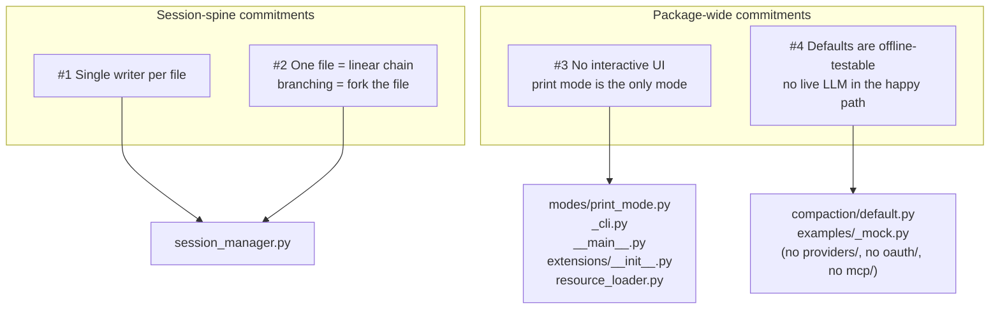
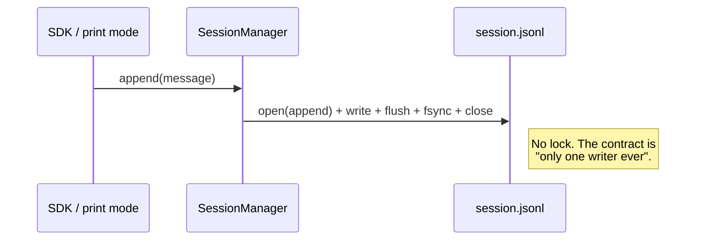
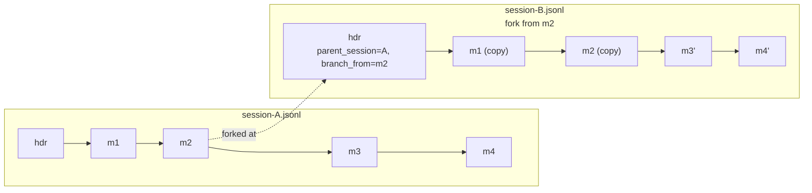

# Architecture: `edc_agent.pi.coding_agent`

## Purpose

`edc_agent.pi.coding_agent` is a Python port of a scoped subset of the
upstream TypeScript `coding-agent` package
(`vendor/pi-mono-upstream/packages/coding-agent`). The port is **not** a
1:1 translation. Every module trims surface area in deliberate, mutually
reinforcing ways so the result is small enough to read end-to-end and
test without a network.

This document captures the **four architectural tradeoffs** that shape
that trim. New code in this package should be checked against these
commitments; if a change pulls against one of them, the reviewer should
either reject it or explicitly retire the commitment.

The first two tradeoffs come from `session_manager.py` because the
session file is the spine of the harness — they constrain what
"persistence" and "branching" mean for everything else. The remaining
two are package-wide commitments visible across `extensions/`,
`modes/`, `compaction/`, `tools/`, `resource_loader.py`, and
`config.py`. Together those two are also the reason this package's
**core is much smaller than upstream's** — the smallness is a
consequence of #3 and #4, not a separate commitment to "minimalism."

> Note on layering: this package depends on `edc_agent.pi.ai` for
> provider/model concerns (Anthropic, Gemini, OpenAI, Gateway, SSE,
> tool-call serialization). That is not listed below as a tradeoff
> because it is not a port-level choice — it is the layering rule
> baked into `pi.ai`'s purpose, identical to upstream's
> `@pi/ai-sdk` vs `@pi/coding-agent` split. See
> `agents/agent/Architecture-Pi.md` for that boundary.

## The four tradeoffs at a glance

Each tradeoff is described below as **What we kept**, **What we gave
up**, and **Where it shows up in the code**, plus a diagram or short
illustration where one helps.

---

## Tradeoff 1 — Single writer per session file

**Commitment.** Exactly one Python process writes to a given JSONL
session file at any moment.

**Benefit.** Append is one syscall sequence
(`write` → `flush` → `fsync`) with no locks. Crash recovery is
trivial — the loader keeps parsed lines and ignores a truncated
tail. Files are human-readable JSONL: `cat` and `tail -f` work
without tooling.

**Reason.** All callers are single-process by construction (SDK +
print-mode CLI; #3 makes "no daemon" explicit). Designing for
multi-writer safety would pay lock overhead on every append for a
scenario that never happens. Elevating "single writer" from runtime
accident to design contract lets us delete the locking,
atomic-rename, and index-invalidation paths that would otherwise have
to exist "just in case."

**What we gave up.**

- No file-level locking (no `flock`, no lockfile sidecar). Two writers
  pointed at the same file *will* interleave lines.
- No crash-safe atomic-rename pattern. A power-cut mid-write leaves a
  truncated last line, which the loader treats as the new tail.
- No in-memory `dict[str, Entry]` index. `find()` and `branch_from()`
  do an O(n) linear scan because nothing else can invalidate the cache
  between calls.

**Where it shows up.**

- `session_manager.py::_append_line` — open / write / flush / fsync /
  close. No retries, no fsync-of-directory, no rename dance.
- `session_manager.py::find` — linear scan over `self._entries`.
- The CLI is single-process by construction (`__main__.py`,
  `_cli.py`); there is no daemon, no IPC, no `--server` mode.

---

## Tradeoff 2 — One file is a linear chain; branching forks the file

**Commitment.** Each session file is a strict linear list of entries
(`parent_id` → previous entry's `id`). Branching = fork the file: a
new file whose header points at the source via `parent_session`,
never multiple children of the same entry inside one file.

**Benefit.** Replay is `for entry in file` — no graph walk, no
"which child to follow?" disambiguation. Each file is
**self-contained**: copying or moving `session-B.jsonl` does not
break it, because the prefix is copied in at fork time. A reviewer
reads it top-to-bottom like a chat log.

**Reason.** Branching is rare; linear extension is the common case.
A DAG-in-one-file format would charge every sequential read the cost
of multi-child navigation. Forking inverts that: linear append stays
trivial, and the prefix-copy cost on `branch_from` is paid only when
someone actually branches. Self-containment is a downstream win —
each file is a legitimate transport unit (ship, diff, archive)
without the parent file in hand.

**What we gave up.**

- Disk duplication on every fork: `branch_from()` deep-copies the
  prefix of the source file into the new file so the new file is
  self-contained up to the branch point.
- No tree-shaped navigation API. Callers cannot ask "give me all
  branches off entry X"; they have to keep their own list of branched
  filenames.
- Multi-child branching inside a single file is structurally
  impossible. If you need it, the answer is "open another file".

**Where it shows up.**

- `session_manager.py::branch_from` — copies the prefix and writes a
  fresh file.
- `session_manager.py::iter_messages` — single forward pass.
- The header entry carries `parent_session` so a reader can chase the
  fork chain across files when they need to.

The cost (copying `m1` and `m2` into B) buys the property that
`SessionManager.load("session-B.jsonl")` needs nothing else on disk to
be replayable.

---

## Tradeoff 3 — No interactive UI surface

**Commitment.** Print mode is the only execution mode:
non-interactive, write-once-and-exit, text-or-JSON output. No TUI,
REPL, RPC, OAuth, keybindings, or session picker.

**Benefit.** The CLI is trivially scriptable — stdin in, stdout out,
exit code in the usual place. No keypress dispatch, no terminal
capability detection, no async UI loop. A run is a function call:
arguments in, result out, process exits. That shape composes
naturally with shell pipelines, CI jobs, and Python callers.

**Reason.** This package targets **backend Python agents** (ML
pipelines, evaluators, learning agents) — not interactive developer
chat. There is no human at a terminal to consume a TUI. Carrying
upstream's UI surface would mean porting code with no consumer here,
or maintaining stubs forever; both pay maintenance cost for zero
value. Declaring "no UI" lets us delete entire subsystems
(renderers, slash dispatch, OAuth callbacks, MCP discovery) instead
of carrying them as dead weight, and keeps the Extension API
readable in one sitting.

**What we gave up.**

- No interactive chat loop. `agent run` does one turn-set and exits;
  re-entry means a fresh process (which is fine because of tradeoff
  #1).
- No human approval / confirmation prompts mid-run. Tools that would
  normally gate on the user (e.g. destructive bash) either run or are
  excluded by the caller.
- No live-rendering of streamed tokens to a fancy widget. Streaming is
  exposed through `AgentSession.stream()` and the public
  `AgentEvent` types, but the print-mode renderer flattens it to
  stdout chunks.
- No keybindings, slash-command REPL, session picker, or TUI session
  switcher.

**Consequences for the upstream core surface** (this is where the
"minimal core" feel comes from — no UI to drive these, so they were
dropped wholesale rather than ported behind a flag):

- **Extension API is five entry points** — `on`, `register_tool`,
  `add_system_prompt_section`, `add_message`, and the per-run
  context. Upstream's `addRenderer` / `registerSlashCommand` /
  `addKeybinding` / `registerProvider` / `addAuth` all presuppose a
  UI or network surface this package does not have.
- **Loader is `importlib` over `{agent_dir}/extensions/*.py`** — no
  marketplace, no version negotiation, no `PYTHONPATH` discovery.
  Frozen for the run after startup.
- **Resource loading is scoped to `AGENTS.md`** — no generic
  resource subsystem; `skills.py` / `utils/frontmatter.py` accept
  flat YAML only.
- **No CLI flags for provider / model / reasoning-effort.** The
  caller constructs a `Model` in Python and passes it to
  `sdk.run_once`.

Run-time auditability is preserved the upstream way (explicit
registration + session-header log); it does **not** depend on the
surface being small.

**Where it shows up.**

- `modes/print_mode.py` — the entire mode module, ~one screen of code,
  branching only between `text` and `json` output.
- `_cli.py` / `__main__.py` — argparse CLI; no `commander`-style
  subcommand tree. Flags are limited to what print mode needs.
- `extensions/__init__.py` — the entire public Extension API surface
  (the five entry points above).
- `extensions/runner.py` — the loader; `importlib` plus a single
  lifecycle pass.
- `resource_loader.py` — only loads `AGENTS.md`-style context files.
- `skills.py` and `utils/frontmatter.py` — flat YAML frontmatter
  only.

---

## Tradeoff 4 — Defaults are offline-testable

**Commitment.** Default code paths must run without a network or a
real LLM. Live-LLM behavior is not removed — it is **opt-in via
callable seams** (`DefaultCompactor.summarize_fn`, the
caller-supplied `Model`), so production callers wire it in with one
argument.

**Benefit.** `uv run pytest` works without an API key. Examples run
end-to-end against `_mock.py`. New contributors clone, run
`examples/01_hello_world.py`, and it works on the first try — no
provisioning. CI never gates on third-party rate limits or outages.
And critically, the production path is **not** a different code
path: pass `summarize_fn=` or a real `Model` and the same classes
run live. No "test mode vs production mode" branch to drift.

**Reason.** A default that requires a live LLM is undemoable,
untestable in CI without secrets, and forces every prospective
consumer to provision credentials before evaluating the package.
Third-party endpoints have outages, rate limits, and credential
rotations on schedules we don't control. Offline-deterministic
defaults plus one-argument callable seams everywhere a model would
be called give fast, reproducible development feedback without
giving up the production capability.

**What we gave up.**

- The **default** compactor summary is deterministic (file-ops +
  last-assistant-text), not LLM-driven. LLM compaction is opt-in:
  `DefaultCompactor(summarize_fn=my_async_summarizer)`. Token
  budgeting, `keep_tail`, and summary-message injection are
  identical in both modes.
- Examples use the mock `Model` from `_mock.py`, so they demonstrate
  *API shape*, not *model output quality*.
- Known caveat: the synthetic `compactionSummary` message role is
  not in the `AgentContext` validator's allow-list, so
  `08_compaction.py` runs compaction in isolation. (The caveat is
  about the message envelope, not the summary string, so it applies
  even with `summarize_fn` supplied.)

**The pattern this tradeoff is teaching.** Default to an
offline-deterministic implementation; expose a one-argument callable
seam (not a subclass, not a feature flag) for callers to plug in
the live-LLM version. `DefaultCompactor.summarize_fn` is the
template, not an exception — new defaults should follow the same
shape.

**Consequences for the upstream core surface** (the second half of
"why is this package's core smaller than upstream's"):

- **No OAuth / credential-bootstrap subsystem** — anything that
  prompts a browser or asks for an API key is excluded. Callers
  construct credentials before reaching this package.
- **No MCP server registry / discovery** — MCP is a network
  protocol; a default-on MCP loader would break offline-testability.
  Callers who need it wire it in themselves.
- **No provider-side telemetry in the default path** — such hooks
  live in `pi.ai` if added there.
- **No live-LLM call in any default code path** — anything that
  "wants" to call a model from a default must expose a callable
  seam, the way `DefaultCompactor.summarize_fn` does.

**Where it shows up.**

- `compaction/default.py::DefaultCompactor` — token-budget compactor
  with a deterministic file-ops summary by default and a
  `summarize_fn` seam for live-LLM summarization. The class is the
  same in both modes; the choice is per-instance.
- `agents/agent/examples/pi/coding_agent/_mock.py` — the mock
  `Model` and helper streams used by every example.
- `defaults.py` — wiring that prefers the deterministic compactor.
- The absence of `coding_agent/oauth/`, `coding_agent/mcp/`, and a
  provider registry is itself the artifact: directories that exist
  upstream were deliberately not created here.

---

## How the four tradeoffs reinforce each other

Each tradeoff is locally defensible, but the real reason to keep them
all is that they line up:

- **#1 (single writer)** is only safe because **#3 (no interactive
  UI)** — there is no long-lived daemon, RPC server, or session
  switcher that would need to multiplex writers to the same file.
- **#2 (linear chain)** is only ergonomic because **#1 (single
  writer)** — with no concurrent writers, every entry has exactly
  one parent at the time it is appended, and the per-file linear
  chain is the natural representation.
- **#3 (no UI)** plus **#4 (offline defaults)** are what give the
  package its "small core" feel. Together they delete most of
  upstream's renderer / TUI / extension-marketplace surface (#3) and
  most of upstream's OAuth / MCP / live-LLM-default surface (#4).
  The remaining core is what stays after both subtractions.
- **#3 + #4** is also why the Extension API ends up at five entry
  points instead of fifty: with no UI to render to and no live
  network in the default path, there is nothing for `addRenderer`
  or `registerProvider` to attach to.

Note that "minimal core" is *not* listed as a separate tradeoff. The
upstream TypeScript package has a fat core and still has run-time
auditability (extension registration is explicit there too). The
smallness of this port's core is a *consequence* of #3 and #4, not a
goal in its own right.

If a future change retires any one of these four, the reviewer should
walk through the other three and check which ones it weakens by
extension. In particular:

- Re-introducing a UI surface (#3) immediately re-opens the question
  of multi-writer safety (#1) and pulls the Extension API back
  toward upstream's larger shape.
- Re-introducing live-network defaults (#4) re-opens
  offline-testability for examples and CI, and likely brings back
  OAuth / MCP / telemetry surface area.

## See also

- `agents/agent/examples/pi/coding_agent/` — runnable examples that
  exercise each tradeoff in isolation.
