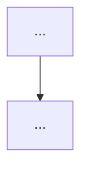

# Prompts / templates

These are stable templates the agent (or a CLI wrapper) can use for consistent outputs.

## Diagram → Mermaid (vision-assisted)

**Input**
- Figure image
- Caption text (if any)
- 1–2 surrounding paragraphs

**Instruction**
- If representable as Mermaid, output Mermaid only.
- Otherwise output a structured description.
- Do not invent nodes/edges that are not visible.
- Use safe Mermaid node IDs (no spaces).

**Output format**

If Mermaid is possible:



If Mermaid is not possible:

```text
FigureType: flowchart|architecture|chart|equation|screenshot|photo
Entities:
- ...
Relationships:
- ... -> ... (label)
Notes:
- ...
```

## Table QA (post-extraction)

Given an extracted table grid, validate:
- rectangularity (same columns per row)
- obvious header row(s)
- whether the table looks like a false positive

If confidence is low, recommend:
- emit CSV sidecar
- or embed image and request manual repair
